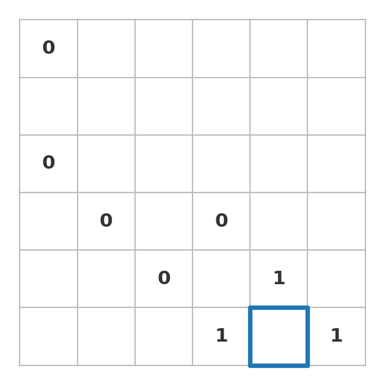
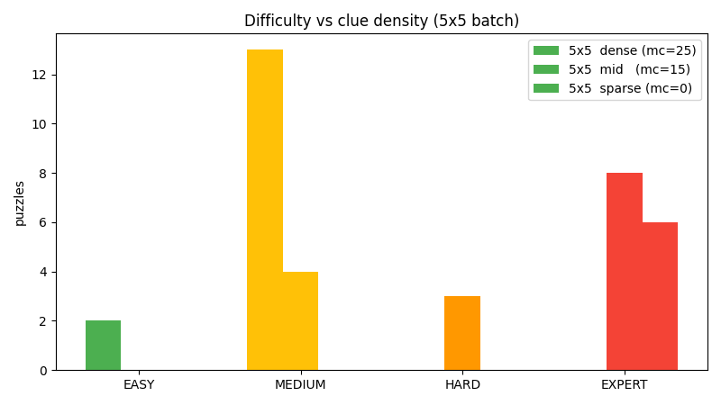

# Slitherlink Puzzle Generator

[](https://github.com/zyx100089-eng/puzzle-generator/actions/workflows/tests.yml)
[](https://www.python.org)
[](LICENSE)

Generate Slitherlink puzzles with unique solutions, and grade their
difficulty by the *techniques a human would need*.



*`python3 cli.py --h 6 --w 6 --seed 3` — a generated puzzle (clues in
black) with the unique solution loop overlaid in blue. Every clue
earns its place: removing any one of them would admit a second
solution.*

Most work on logic puzzles builds solvers. This project does the
inverse: given a loop, it deletes clues one at a time (re-checking
uniqueness after every deletion) until no clue can be removed — a
fixed point. The output is a minimal puzzle where every clue earns its
place.

## Why I chose Slitherlink

I wanted a constraint problem with three properties:

1. **A natural difficulty hierarchy.** Slitherlink can be solved by
   purely local rules (clue saturation, corners), then vertex-degree
   rules, then global loop/connectivity reasoning, then search. That
   maps onto difficulty tiers almost by itself.
2. **A duality I could exploit.** The solver's rules are exactly the
   tools the generator needs to verify uniqueness — one codebase, two
   jobs. I liked that the generator and solver are the same machine
   pointing in opposite directions.
3. **Something I'd actually play.** Sudoku generators exist everywhere.
   Slitherlink was a puzzle I could get wrong in interesting ways.

## How it works

**Generation.** A loop is built from random spanning trees: the
fundamental cycles of a spanning tree, combined with random
rectangles, produce valid loop shapes. Clues are then deleted
one-at-a-time with uniqueness re-verified after each deletion, until
no further deletion preserves uniqueness (a fixed point).

**Solving.** The solver applies technique tiers in order: clue rules
(saturation, edge count) → corner rules (corner-1/corner-3
unconditional, corner-2 conditional) → vertex degree rules → loop and
connectivity rules (no-early-loop) → probing (failed-literal detection)
when deduction stalls.

**Difficulty grading.** Which tier is needed decides the grade:

| Tier | Techniques needed |
|---|---|
| EASY | clue rules only |
| MEDIUM | + vertex rules |
| HARD | + loop rules |
| EXPERT | search (guess-count sub-metric, capped at 8) |



*Dense puzzles solve with local rules only; sparse minimal puzzles
stall deduction and require search. `generate(..., target=...)` uses
rejection sampling to hit a specific tier.*

**The fixed point.** Uniqueness proofs are bounded by a node budget.
A search that exceeds the budget is treated as *not provably unique* —
so the guarantee is precise: no clue is removable while keeping
uniqueness, as proven within the budget. (The headline "provably
unique" therefore has this scope; beyond the budget, the puzzle is
minimal *as far as I checked*.)

## What's verified

- **Rule soundness, exhaustively.** On every valid loop of small
  grids — 1275 loops across 2×2, 3×3, and 3×4 grids — the deduction
  rules never contradict the loop. The solver operates on a private
  copy of the puzzle and never mutates the caller's state.
- **Batch verification** (`verify.py`): uniqueness, minimality,
  solvability, and difficulty distribution across generated puzzles.
- **Unit tests**: 25 tests including the solver, generator, and
  grading.

## Performance

The loop-closure rule is O(E) per call: ON-edge clue counts are
computed once, with early exit when there are no ON edges. Uniqueness
checks on near-minimal 6×6 puzzles cost ~5 s each, so generating a
sparse 6×6 puzzle takes about 75 s — the price of proving uniqueness
by construction.

## What I didn't do (and why)

- **Human calibration.** The difficulty tiers model human technique,
  but I never tested them against actual solvers. The tiers are
  *plausible*, not *validated* — I'd want a few hundred puzzle-times
  from real people before claiming more.
- **Larger grids.** 6×6 is the practical ceiling for the
  exhaustive soundness check and for acceptable generation time.
  Everything scales, but the verification doesn't.

## Files

| File | Purpose |
|---|---|
| `grid.py` | Grid model (cells, clue numbers, edges), index-based internals |
| `solver.py` | Constraint solver with the technique hierarchy |
| `generator.py` | Random-loop generation, clue deletion with uniqueness verification, difficulty-targeted rejection sampling |
| `difficulty.py` | Difficulty grading into four tiers |
| `cli.py` | Play, generate, and grade from the terminal; play mode has a `hint` command explaining the technique that decides the next edge |
| `verify.py` | Batch verification: uniqueness, minimality, solvability, difficulty distribution |
| `soundness.py` | Exhaustive rule-soundness check over all valid loops on small grids |
| `demo.py` | One puzzle per tier, generator/solver duality, difficulty distribution chart |
| `test_puzzle.py` | 25 unit tests |

## Running

```
python3 -m pytest test_puzzle.py -q   # unit tests (~30 s)
python3 soundness.py                  # exhaustive rule soundness
python3 verify.py                     # full verification (minutes)
python3 demo.py                       # difficulty tiers walkthrough
python3 cli.py --h 6 --w 6 --seed 3 --grade
python3 cli.py --play                 # play with hints
```

## How to verify my work

The claims in this README each have a dedicated check, in increasing
order of cost:

```bash
python3 -m pytest test_puzzle.py -q   # 25 unit tests (~30 s)
python3 soundness.py                  # EVERY valid loop on small grids:
                                      # 1275 loops across 2x2, 3x3, 3x4 —
                                      # deduction rules never contradict
                                      # a true loop (~1 min)
python3 verify.py                     # uniqueness, minimality, solvability
                                      # + difficulty distribution over a
                                      # batch (~5 min)
```

The headline "every clue earns its place" is `verify.py`'s
`check_minimal`: for each clue, removing it must admit a second
solution or make the puzzle unsolvable. The "provably unique" claim
is bounded by the search budget — `verify.py` runs with a 100k-node
budget and asserts the guarantee at exactly that scope, no more.

## Playing with hints

The `--play` mode is the part of the project that's easiest to miss:
the `hint` command runs the solver's deduction rules on a copy of the
puzzle and explains *which technique* decides the next edge, in human
terms:

```
$ python3 cli.py --h 5 --w 5 --seed 7 --play
Generated puzzle:
+ + + + + +
 2   1     
+ + + + + +
 2   1     
+ + + + + +
   1 0     
+ + + + + +
           
+ + + + + +
     0     
+ + + + + +

Toggle edges with 'r,c-h' / 'r,c-v', 'hint' for a hint, 'done' to finish, 'quit' to quit.
> hint
  hint: cell (2,2) already has its clue count on: the remaining edges must be OFF
+ + + + + +
 2   1     
+ + + + + +
 2   1     
+ + + + + +
   1 0     
+ + + + + +
           
+ + + + + +
     0     
+ + + + + +
> 
```

The hint text is generated from the same technique hierarchy that
grades difficulty — the solver, the generator's uniqueness check, and
the player's hints are all one machine.

## References

- Slitherlink rules: https://en.wikipedia.org/wiki/Slitherlink
- Norvig's Sudoku solver write-up (solver philosophy)

## What I'd do next

- Calibrate the difficulty tiers against real solve times.
- A `hint` mode that explains *why* the next rule fires (it exists
  in `cli.py`; I'd want it visualised).
- Larger grids with a bounded-search uniqueness proof instead of
  exhaustive soundness.
